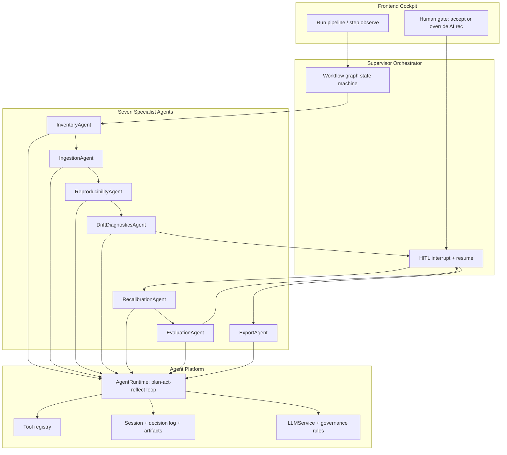

# Agentic Architecture Transformation Plan

## Executive summary

Today the product has **7 UI workflow steps** but only **5 backend “agents”** ([`agents.py`](backend/app/api/agents.py)). Those agents are **progress-reporting job runners** ([`base.py`](backend/app/services/base.py)): fixed task lists, no tool loop, no LLM calls (despite scaffolded [`llm_service.py`](backend/app/services/llm_service.py)), and **no orchestrator**—the React app drives order via `setStep()` and `runAgent()`.

The target is a **regulated, agentic pipeline**: a **Supervisor** runs seven **specialist agents** end-to-end; each specialist can **plan → act (tools) → observe → reflect**; the UI becomes an **observability + decision cockpit** where humans **accept AI recommendations or override** at defined gates.

**Recommended orchestration for this codebase:** **LangGraph-style workflow graph** implemented in Python (explicit nodes/edges, checkpointing, HITL interrupts). Start with a **thin custom graph** on FastAPI to reuse existing SSE/session patterns; add **`langgraph`** as a dependency in Phase 3 if you want standard primitives (interrupt/resume, checkpoints) without rewriting semantics.



---

## Current state (gap analysis)

| Capability | Today | Target |
|------------|-------|--------|
| **Agents** | 5 scripted classes; Inventory/Export are REST-only | 7 specialists + 1 supervisor |
| **Planning** | `_declare_tasks()` upfront | Dynamic sub-goals within agent bounds |
| **Tools** | Inline Python in `run()` | Registered, schema’d, idempotent tools |
| **Memory** | In-memory `session` dict ([`session.py`](backend/app/utils/session.py)) | Durable workflow + episodic decision log |
| **Reflection** | Fail → `task_failed` | Retry/replan with capped iterations |
| **Handoffs** | Frontend `rcl:step` + session keys | Orchestrator messages + typed handoff payloads |
| **LLM** | Wired but unused | Planning, recommendations, audit narratives |
| **HITL** | [`FinalHitlPanel`](frontend/src/components/diagnostics/FinalHitlPanel.tsx), recal config, eval override | Same gates, driven by `human_input_required` events |
| **Autonomy** | User clicks each stage | Optional **Run full pipeline** with pauses at gates |

**Key insight:** Keep **deterministic ML/statistics** as tools (governance thresholds in [`governance.py`](backend/app/core/governance.py), drift `_recommend`, evaluation `_evaluate_policy_guardrails`). Use the LLM for **orchestration, explanation, and structured recommendations**—not for floating-point drift math. This preserves MRM defensibility.

---

## Target: seven specialist agents

Map 1:1 to [`ACTIVITIES`](frontend/src/App.tsx) in [`App.tsx`](frontend/src/App.tsx).

| Agent | Registry key | Primary goal | Core tools (extracted from today) | HITL gate |
|-------|--------------|--------------|-----------------------------------|-----------|
| **Inventory** | `inventory` (new) | Select model + diagnostic/eval metric profile | `list_models`, `score_model_eligibility`, `set_workflow_config` | User confirms model (agent pre-selects best match) |
| **Ingestion** | `ingestion` | Load/validate data + model artifacts | `parse_dataset`, `validate_preprocessing`, `validate_features`, `infer_schema` | User confirms target/outcome columns (agent suggests) |
| **Reproducibility** | `reproducibility` | Reproduce scores & preprocessing | `apply_preprocessing`, `apply_features`, `score_cohort`, `compare_scores` | None (auto); surface verdict in UI |
| **Drift diagnostics** | `drift` | Drift report + **recommended action** | `compute_*_drift`, `assemble_drift_report`, `recommend_action` | **Gate:** accept/override diagnostic action ([`FinalHitlPanel`](frontend/src/components/diagnostics/FinalHitlPanel.tsx)) |
| **Recalibration** | `recalibration` | Train/tune new model | `propose_feature_drops`, `configure_hp_space`, `run_tuning`, `train_final`, `serialize_model` | **Gate:** confirm drops + HP (agent pre-fills from drift) |
| **Evaluation** | `evaluation` | Compare old vs new + guardrails | `score_oot`, `compute_metrics`, `evaluate_guardrails`, `build_comparison` | **Gate:** promotion if `warn`/`block` (existing override) |
| **Export** | `export` (new) | Package MRM artifacts + narrative | `assemble_export_bundle`, `generate_mrm_summary` (LLM) | None if guardrails `pass`; else blocked until eval gate cleared |

**Supervisor agent** (`supervisor`): owns workflow graph, invokes specialists, aggregates traces, emits `workflow_state` events, calls `pause_for_human(decision_type, recommendation, context)`.

Use existing `inception_result` session slot for **Inventory** output (already reserved in [`session.py`](backend/app/utils/session.py) but unused).

---

## Agent platform (new backend modules)

Add under `backend/app/agentic/` (keeps legacy [`services/*_agent.py`](backend/app/services/) stable during migration).

### 1. `AgentRuntime` — plan / act / observe / reflect

```python
# Conceptual loop (max_iterations, timeout per agent)
while not goal_satisfied and iterations < max_iter:
    plan = await llm.plan(goal, memory, tool_schemas)      # structured JSON
    for action in plan.actions:
        result = await tools.execute(action.name, action.args)
        await emit_tool_event(...)
        if result.needs_human:
            raise HumanInterrupt(...)
    reflection = await llm.reflect(goal, results)
    if reflection.status == "done":
        break
    elif reflection.status == "retry":
        continue
    else:
        fail with audit trail
```

- **Structured outputs only** (Pydantic models): no free-form tool args from LLM without validation.
- **Fallback:** if `LLM_ENABLED=false`, runtime runs **fixed tool DAG** (current behavior)—zero regression for demos/CI.

### 2. `ToolRegistry`

- Register tools with: `name`, `description`, `input_schema`, `output_schema`, `idempotent`, `side_effects`.
- Phase 1: wrap existing functions from [`ingestion_agent.py`](backend/app/services/ingestion_agent.py), [`reproducibility_agent.py`](backend/app/services/reproducibility_agent.py), [`drift_agent.py`](backend/app/services/drift_agent.py), [`recalibration_agent.py`](backend/app/services/recalibration_agent.py), [`evaluation_agent.py`](backend/app/services/evaluation_agent.py).
- Tools call `asyncio.to_thread` for heavy work (same as today).
- **Governance tools** are deterministic: `classify_csi`, `recommend_action`, `evaluate_guardrails`.

### 3. `MemoryStore`

| Layer | Contents | Storage |
|-------|----------|---------|
| **Working** | Session fields, artifact paths | Upgrade [`session.py`](backend/app/utils/session.py) → SQLite or Redis + file store under `/tmp/sessions` |
| **Episodic** | Per-agent plans, tool calls, reflections, HITL decisions | `session["agent_memory"][]` with timestamps |
| **Semantic** | Governance YAML, model registry metadata | Load from config; inject into agent system prompts |

### 4. `WorkflowOrchestrator` + graph

Graph nodes (sequential with conditional branches):

```
inventory → ingestion → reproducibility → drift
  → [HITL: diagnostic_action] → recalibration
  → [HITL: recal_config] → evaluation
  → [HITL: promotion_if_needed] → export → END
```

Branch examples (already implicit in code):

- Reproducibility fail → supervisor pauses with remediation suggestions (re-upload, fix preprocessing).
- Drift `no_action` → skip HP tuning branch in recalibration ([`selected_recommended_action`](backend/app/services/recalibration_agent.py)).
- Evaluation `block` → cannot reach export ([`export.py`](backend/app/api/export.py)).

**Checkpointing:** persist `workflow_run_id`, `current_node`, `pending_hitl` so refresh/resume works.

### 5. HITL bridge (your stated policy)

New API surface:

| Endpoint | Purpose |
|----------|---------|
| `POST /api/workflow/runs` | Start autonomous pipeline (`mode: supervised \| autonomous`) |
| `GET /api/workflow/runs/{id}/events` | SSE: workflow + nested agent events |
| `POST /api/workflow/runs/{id}/resume` | Body: `{ gate, decision, rationale, overrides? }` |
| `GET /api/workflow/runs/{id}/pending-hitl` | Current recommendation + context |

Event type: `human_input_required` with payload:

```json
{
  "gate": "diagnostic_action",
  "recommendation": { "action": "recal_with_hp_opt", "rationale": "...", "confidence": 0.82 },
  "allowed_actions": ["no_action", "recal_same_hp", "recal_with_hp_opt"],
  "context_ref": "drift_result"
}
```

Frontend: generalize [`FinalHitlPanel`](frontend/src/components/diagnostics/FinalHitlPanel.tsx) → `AgenticHitlPanel` reused for diagnostic, recal, and promotion gates. **Always show AI recommendation first; user selects it or picks another option.**

Wire existing APIs as implementation detail:

- `saveDiagnosticDecision` → resume after `diagnostic_action` gate
- `configureRecalibration` → resume after `recal_config` gate  
- Evaluation override → resume after `promotion` gate

### 6. Observability

- Extend [`AgentEvent`](backend/app/services/base.py) with: `tool_call`, `plan`, `reflection`, `handoff`, `human_input_required`.
- Correlate with `trace_id` / `workflow_run_id` across agents.
- Optional: OpenTelemetry spans on tool execution (Phase 6).

---

## LLM integration strategy

Use existing [`LLMService`](backend/app/services/llm_service.py) + [`llm_routing.py`](backend/app/core/llm_routing.py) contexts:

| Context | Used by |
|---------|---------|
| `drift_diagnostics` | Drift agent narrative + action rationale enrichment |
| `recalibration` | Feature-drop explanation, HP strategy summary |
| `evaluation` | Guardrail explanation for HITL panel |
| `policy_guardrails` | Promotion recommendation text |
| `export_mrm` | ExportAgent MRM summary document |

**Rules:**

- LLM never overrides hard guardrails (`block` stays `block`).
- Recommendations must cite tool outputs (signal grid, metrics JSON).
- Log full prompt/response in episodic memory for audit.

---

## Frontend changes (observability-first)

| Area | Change |
|------|--------|
| [`AgentStepper.tsx`](frontend/src/components/AgentStepper.tsx) | Subscribe to workflow SSE; show nested agent + tool timeline |
| [`App.tsx`](frontend/src/App.tsx) | Add **Run pipeline**; step nav becomes progress indicator, not sole driver |
| Pages | Remove scattered `runAgent` on mount; orchestrator triggers runs |
| New | `WorkflowCockpit.tsx`: live trace, pending HITL banner, resume actions |
| Session | Persist `workflow_run_id`, `pending_hitl` in [`session.ts`](frontend/src/contexts/session.ts) |

**Human intervention after refactor (minimal but explicit):**

1. Inventory — confirm model (AI pre-selection)
2. Ingestion — confirm schema mapping (AI inference)
3. Diagnostics — accept/override action (**required gate**)
4. Recalibration — confirm feature drops / HP (**required gate**)
5. Evaluation — override only on `warn`/`block` (**conditional gate**)

Everything else runs autonomously between gates.

---

## Migration strategy (phased, low risk)

### Phase 0 — Platform skeleton (1–2 weeks)

- Create `backend/app/agentic/` package: `runtime.py`, `tools.py`, `memory.py`, `schemas.py`, `orchestrator.py`
- Add `WorkflowRun` model + durable session store (SQLite minimum)
- Feature flag: `AGENTIC_MODE=false` (default) preserves current UX

### Phase 1 — Tool extraction (2 weeks)

- Extract pure functions from each `*_agent.py` into `backend/app/agentic/tools/`
- Unit-test tools independently (no LLM)
- Legacy agents call tools internally (thin wrapper)—behavior unchanged

### Phase 2 — AgentRuntime on one pilot (1 week)

- Pilot: **DriftDiagnosticsAgent** — LLM enriches `_recommend` rationale; tools unchanged
- Prove structured plan + tool loop + SSE events

### Phase 3 — Workflow orchestrator (2 weeks)

- Implement graph + HITL interrupt/resume
- `POST /api/workflow/runs` behind feature flag
- Optional: adopt `langgraph` for checkpoint/interrupt if custom graph proves verbose

### Phase 4 — Remaining specialists (2–3 weeks)

- Wrap ingestion, reproducibility, recalibration, evaluation with runtime (deterministic fallback)
- Add **InventoryAgent** ([`workflow.py`](backend/app/api/workflow.py) logic → tools)
- Add **ExportAgent** ([`export.py`](backend/app/api/export.py) logic → tools + LLM summary)

### Phase 5 — Frontend cockpit (2 weeks)

- `WorkflowCockpit`, generalized HITL panel, pipeline run button
- Deprecate page-level auto-`runAgent` when orchestrator active

### Phase 6 — Hardening (ongoing)

- Retry policies (transient I/O), session recovery, integration tests for full graph
- Load/performance caps on HP tuning (existing caps in recalibration agent)
- Security: tool arg validation, session isolation, no path traversal on uploads

---

## API / registry changes

Extend [`AGENT_REGISTRY`](backend/app/api/agents.py):

```python
AGENT_REGISTRY = {
    "inventory": (...),
    "ingestion": (...),
    "reproducibility": (...),
    "drift": (...),
    "recalibration": (...),
    "evaluation": (...),
    "export": (...),
}
```

Add parallel **workflow** router (`backend/app/api/workflow_runs.py`) for supervisor; keep per-agent `/run` for debugging and single-step reruns.

Update frontend [`AgentName`](frontend/src/services/api.ts) union + [`DEFAULT_AGENT_TASKS`](frontend/src/components/AgentStepper.tsx).

---

## Testing strategy

| Level | What |
|-------|------|
| Tool unit tests | Each extracted tool with fixture session + parquet samples |
| Agent tests | Mock LLM → fixed plan JSON; assert tool call sequence |
| Graph integration | Demo mode end-to-end with `LLM_ENABLED=false` |
| HITL tests | Pause at gate → resume with accept vs override → assert session keys |
| Regression | Compare `drift_result`, `recalibration_result`, `evaluation_result` JSON to golden files |

---

## Risks and mitigations

| Risk | Mitigation |
|------|------------|
| LLM non-determinism breaks MRM trust | Hard tools for metrics; LLM only for narrative + structured recs validated against rules |
| Long-running pipeline timeouts | Supervisor checkpoints; resumable nodes; HP tuning caps (existing) |
| Session loss on restart | Phase 0 durable store |
| Scope creep | Feature flag; phase gates; keep legacy path until Phase 5 complete |
| Over-automation in regulated context | Your policy: gates stay; AI rec always visible; audit log immutable |

---

## Success criteria

- User can click **Run pipeline** and reach Export with **≤5 explicit human decisions** (inventory, ingestion schema, diagnostic action, recal config, conditional promotion).
- Every decision stores **AI recommendation + user choice + rationale** in episodic memory.
- Each specialist emits **tool-level trace** (not only 6–9 coarse tasks).
- `LLM_ENABLED=false` runs full pipeline deterministically for CI/demo.
- No regression in drift/recal/eval numeric outputs vs current golden runs.

---

## Recommended first implementation slice (after plan approval)

1. Phase 0 skeleton + durable session  
2. Phase 1 drift tools extraction  
3. Phase 2 drift agent runtime + enriched recommendation  
4. Phase 3 orchestrator with **drift HITL gate only** wired to existing `FinalHitlPanel`  

This delivers a visible “agentic” vertical slice before migrating all seven agents.
