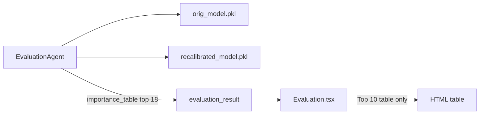
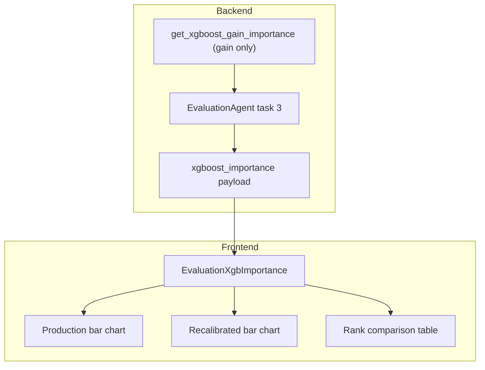

# XGBoost Gain-Based Importance Views (Evaluation)

## Goal

When **Feature Importance** is enabled in model inventory, show **extra** evaluation views using **gain only** (XGBoost `booster.get_score(importance_type="gain")`):

1. **Bar chart A** — gain importance from the **production (development) model** (`orig_model` / uploaded `.pkl`)
2. **Bar chart B** — gain importance from the **recalibrated model** (`new_model` / `recalibrated_model.pkl`)
3. **Rank comparison table** — per-feature ranks on each model + rank delta + stability rating (reuse diagnostics pattern from [`ShapImportanceTable.tsx`](frontend/src/components/diagnostics/ShapImportanceTable.tsx))
4. **Top N** with **All** (`9999` sentinel, same as [`ConceptDriftTab.tsx`](frontend/src/pages/diagnostics/ConceptDriftTab.tsx))
5. **Keep** the existing Top-10 table in [`Evaluation.tsx`](frontend/src/pages/Evaluation.tsx) (sklearn `feature_importances_`)

**Out of scope for this iteration:** `weight` and `cover` importance types; no importance-type dropdown in the UI.

## Current state



Task `compute_variable_experience` in [`evaluation_agent.py`](backend/app/services/evaluation_agent.py) uses inline `_get_importance()` → sklearn `feature_importances_` (for XGBoost this is typically **weight**, not **gain**). Only **18** features are returned; UI further slices to **10**.

## Target architecture



## Backend changes

### 1. Shared extractor — [`model_helpers.py`](backend/app/utils/model_helpers.py)

Add `get_xgboost_gain_importance(model, feature_cols) -> dict[str, float]`:

- Resolve estimator via existing `resolve_estimator()` (same pattern as [`get_feature_importance`](backend/app/utils/model_helpers.py))
- If `hasattr(model, "get_booster")`:
  - Call `booster.get_score(importance_type="gain")` — **hardcoded to gain**; no `importance_type` parameter on the public API
  - Map booster keys (`f0`, `f1`, …) to human feature names using `booster.feature_names`, then `feature_names_in_`, then `feature_cols` (reuse naming logic from existing `get_booster().feature_names` usage in this file)
  - Return `{feature_name: float_score}` for **all** model features (no top-N cap)
- Else return `{}` (non-XGBoost)

Add `build_xgboost_importance_comparison(orig_imp, new_imp, features) -> list[dict]` producing rows:

| Field | Description |
| ----- | ----------- |
| `feature` | Feature name |
| `champion_importance` | Production model gain score |
| `recal_importance` | Recalibrated model gain score |
| `champion_rank` | Rank by production gain (1 = highest) |
| `recal_rank` | Rank by recalibrated gain |
| `rank_delta` | `champion_rank - recal_rank` |

### 2. Evaluation agent — [`evaluation_agent.py`](backend/app/services/evaluation_agent.py)

Extend **Task 3** (`compute_variable_experience`):

- Keep existing `importance_table` logic unchanged (backward compatible)
- After loading `orig_model` / `new_model`:

```python
champion_gain = get_xgboost_gain_importance(orig_model, feature_cols)
recal_gain = get_xgboost_gain_importance(new_model, feature_cols)
comparison = build_xgboost_importance_comparison(champion_gain, recal_gain, feature_cols)
```

- Add to `result`:

```python
"xgboost_importance": {
    "available": bool(champion_gain or recal_gain),
    "importance_type": "gain",
    "champion": champion_gain,
    "recalibrated": recal_gain,
    "comparison": comparison,
}
```

- Log top-3 features by gain for each model (agent traceability)
- If both models lack booster (e.g. LightGBM-only session), set `available: false` and empty dicts; existing sklearn table still works

**Payload size:** 2 flat dicts + one comparison list — smaller than a multi-type payload; no precomputation of weight/cover needed.

### 3. Tests — new `backend/tests/test_xgboost_importance.py`

- Train small `XGBClassifier` on synthetic data; assert `get_xgboost_gain_importance` returns non-empty dict with correct feature names
- Assert scores match `booster.get_score(importance_type="gain")` for at least one feature (sanity)
- Assert non-XGBoost estimator returns `{}`
- Assert `build_xgboost_importance_comparison` ranks and `rank_delta` behave as expected

## Frontend changes

### 4. New component — `frontend/src/components/evaluation/EvaluationXgbImportance.tsx`

Props: `payload` from `report.xgboost_importance`, gated by inventory **Feature Importance**.

**Layout (single `Card` section below existing table):**

| Control | Behavior |
| ------- | -------- |
| Top `<select>` | `10`, `15`, `9999` (All) — applies to **both** bar charts and rank table |

**No importance-type selector** — UI copy should say “Gain-based” (e.g. section subtitle) so users know this differs from the legacy sklearn table.

**Charts (two separate horizontal bar charts):**

- New `XgbSingleImportanceChart` (adapt from [`ShapImportanceChart.tsx`](frontend/src/components/diagnostics/ShapImportanceChart.tsx) but **one** `Bar` per chart):
  - Left: **Production (Development) Model** — `payload.champion`
  - Right: **Recalibrated Model** — `payload.recalibrated`
  - Sort by that chart’s gain descending; slice by Top N
  - Colors: `theme.series.dev` (production) and `theme.series.new` (recalibrated)

**Rank comparison:**

- Reuse or lightly fork [`ShapImportanceTable.tsx`](frontend/src/components/diagnostics/ShapImportanceTable.tsx):
  - Map `comparison` rows → `championRank` / `recalRank` / `championImportance` / `recalImportance`
  - Column labels from [`evaluation.ts`](frontend/src/config/evaluation.ts)
  - Same rank-delta coloring and Stable / Minor / Major shift badges

**Empty state:** If `!payload?.available`, show muted note: *“Gain-based XGBoost importance is available for XGBoost models only.”* — section hidden or collapsed; legacy table remains.

### 5. Wire into [`Evaluation.tsx`](frontend/src/pages/Evaluation.tsx)

- Parse `report.xgboost_importance`
- When `showFeatureImportance && xgboost_importance.available`, render `<EvaluationXgbImportance />` **below** the existing Top-10 table block (~line 653)
- Do **not** change `impTable.slice(0, 10)` for the legacy table

### 6. Types (optional)

Minimal `XgboostImportancePayload` in [`api.ts`](frontend/src/services/api.ts) or colocated with the component — flat `champion` / `recalibrated` / `comparison`, no per-type nesting.

## Files to touch

| File | Change |
| ---- | ------ |
| [`backend/app/utils/model_helpers.py`](backend/app/utils/model_helpers.py) | `get_xgboost_gain_importance` + comparison builder |
| [`backend/app/services/evaluation_agent.py`](backend/app/services/evaluation_agent.py) | Emit flat `xgboost_importance` (gain only) in task 3 |
| `backend/tests/test_xgboost_importance.py` | Unit tests |
| `frontend/src/components/evaluation/EvaluationXgbImportance.tsx` | New UI section (Top/All only) |
| `frontend/src/components/evaluation/XgbSingleImportanceChart.tsx` | Single-series bar chart (optional split file) |
| [`frontend/src/pages/Evaluation.tsx`](frontend/src/pages/Evaluation.tsx) | Mount new section |
| [`frontend/src/components/AgentStepper.tsx`](frontend/src/components/AgentStepper.tsx) | Optional: help text mentions gain-based XGBoost views |

## Verification

1. Run evaluation on a session with XGBoost production + recalibrated models
2. Confirm two bar charts populate; Top/All changes row count on charts and rank table
3. Rank table shows sensible deltas; ordering matches chart sort by gain
4. Non-XGBoost model: legacy table still shows; XGBoost section shows empty-state message
5. `pytest backend/tests/test_xgboost_importance.py`

## Out of scope (this iteration)

- `weight` / `cover` XGBoost importance types
- LightGBM native importance
- Score migration matrix UI (already computed but not rendered)
