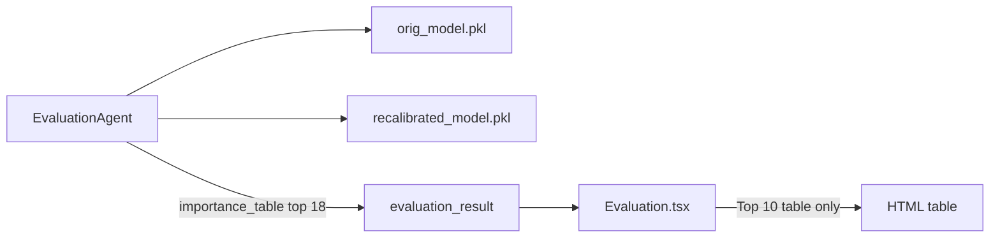
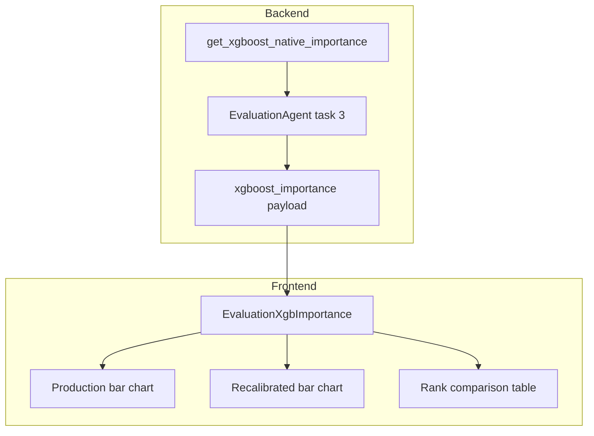

# XGBoost Native Importance Views (Evaluation)

## Goal - Calculate Gain Based XGBoost Native variable importance for production and recalibrated model

When **Feature Importance** is enabled in model inventory, show **extra** evaluation views:

1. **Bar chart A** — native XGBoost gain based variable importance from the **production (development) model** (`orig_model` / uploaded `.pkl`)
2. **Bar chart B** — native XGBoost gain based variable importance from the **recalibrated model** (`new_model` / `recalibrated_model.pkl`)
3. **Rank comparison table** — per-feature ranks on each model + rank delta + stability rating (reuse diagnostics pattern from `[ShapImportanceTable.tsx](frontend/src/components/diagnostics/ShapImportanceTable.tsx)`)
4.  Top N with **All** (`9999` sentinel, same as `[ConceptDriftTab.tsx](frontend/src/pages/diagnostics/ConceptDriftTab.tsx)`)
5. **Keep** the existing Top-10 table in `[Evaluation.tsx](frontend/src/pages/Evaluation.tsx)` (sklearn `feature_importances_`)

## Current state




Task `compute_variable_experience` in `[evaluation_agent.py](backend/app/services/evaluation_agent.py)` uses inline `_get_importance()` → sklearn `feature_importances_` (for XGBoost this is typically **weight**, not **gain**). Only **18** features are returned; UI further slices to **10**.

## Target architecture




## Backend changes

### 1. Shared extractor — `[model_helpers.py](backend/app/utils/model_helpers.py)`

Add `get_xgboost_native_importance(model, feature_cols, importance_type: str) -> dict[str, float]`:

- Resolve estimator via existing `resolve_estimator()`
- If `hasattr(model, "get_booster")`:
  - Call `booster.get_score(importance_type=importance_type)` (`gain` | `weight` | `cover`)
  - Map booster keys (`f0`, `f1`, …) to human feature names using `booster.feature_names`, then `feature_names_in_`, then `feature_cols`
  - Return `{feature_name: float_score}` for **all** model features (no top-N cap)
- Else return `{}` (non-XGBoost)

Add a small helper `build_xgboost_importance_comparison(orig_imp, new_imp, features) -> list[dict]` producing rows:


| Field                 | Description                                 |
| --------------------- | ------------------------------------------- |
| `feature`             | Feature name                                |
| `champion_importance` | Production model score                      |
| `recal_importance`    | Recalibrated model score                    |
| `champion_rank`       | Rank by production importance (1 = highest) |
| `recal_rank`          | Rank by recalibrated importance             |
| `rank_delta`          | `champion_rank - recal_rank`                |


### 2. Evaluation agent — `[evaluation_agent.py](backend/app/services/evaluation_agent.py)`

Extend **Task 3** (`compute_variable_experience`):

- Keep existing `importance_table` logic unchanged (backward compatible)
- After loading `orig_model` / `new_model`, for each `importance_type` in `("gain", "weight", "cover")`:
  - `champion[type] = get_xgboost_native_importance(orig_model, feature_cols, type)`
  - `recalibrated[type] = get_xgboost_native_importance(new_model, feature_cols, type)`
  - `comparison[type] = build_xgboost_importance_comparison(...)`
- Add to `result`:

```python
"xgboost_importance": {
    "available": bool(any champion scores),
    "importance_types": ["gain", "weight", "cover"],
    "default_type": "gain",
    "champion": { "gain": {...}, "weight": {...}, "cover": {...} },
    "recalibrated": { "gain": {...}, "weight": {...}, "cover": {...} },
    "comparison": { "gain": [...], "weight": [...], "cover": [...] },
}
```

- Log top-3 features per type for agent traceability
- If both models lack booster (e.g. LightGBM-only session), set `available: false` and empty dicts; existing table still works

**Payload size:** ~3 types × 2 models × N features — fine for typical 15–30 features; export/PDF already strips heavy arrays in `[export.py](backend/app/api/export.py)` — add `xgboost_importance` to the strip list if PDF size becomes an issue (optional follow-up).

### 3. Tests — new `backend/tests/test_xgboost_importance.py`

- Train small `XGBClassifier` on synthetic data, assert `get_xgboost_native_importance` returns non-empty dict with correct feature names
- Assert `gain` vs `weight` can differ (sanity)
- Assert non-XGBoost estimator returns `{}`

## Frontend changes

### 4. New component — `frontend/src/components/evaluation/EvaluationXgbImportance.tsx`

Props: `payload` from `report.xgboost_importance`, gated by inventory **Feature Importance**.

**Layout (single `Card` section below existing table):**


| Control                    | Behavior                                                                 |
| -------------------------- | ------------------------------------------------------------------------ |
| Importance type `<select>` | `gain` / `weight` / `cover` — switches active maps + comparison rows     |
| Top `<select>`             | `10`, `15`, `9999` (All) — applies to **both** bar charts and rank table |


**Charts (two separate horizontal bar charts):**

- New `XgbSingleImportanceChart` (adapt from `[ShapImportanceChart.tsx](frontend/src/components/diagnostics/ShapImportanceChart.tsx)` but **one** `Bar` per chart):
  - Left chart title: **Production (Development) Model**
  - Right chart title: **Recalibrated Model**
  - Sort rows by that chart’s importance descending; slice by Top N
  - Colors: `theme.series.dev` (production) and `theme.series.new` (recalibrated) for consistency with evaluation cohort styling

**Rank comparison:**

- Reuse or lightly fork `[ShapImportanceTable.tsx](frontend/src/components/diagnostics/ShapImportanceTable.tsx)`:
  - Map `championRank` / `recalRank` / `championImportance` / `recalImportance`
  - Column labels from `[evaluation.ts](frontend/src/config/evaluation.ts)` (e.g. production vs recalibrated wording)
  - Same rank-delta coloring and Stable / Minor / Major shift badges

**Empty state:** If `!payload?.available`, show muted note: *“Native XGBoost importance is available for XGBoost models only.”* — section hidden or collapsed; existing sklearn table remains.

### 5. Wire into `[Evaluation.tsx](frontend/src/pages/Evaluation.tsx)`

- Parse `report.xgboost_importance`
- When `showFeatureImportance && xgboost_importance.available`, render `<EvaluationXgbImportance />` **below** the existing Top-10 table block (~line 653)
- Do **not** change `impTable.slice(0, 10)` behavior for the legacy table

### 6. Types (optional)

Add a minimal `XgboostImportancePayload` interface in `[api.ts](frontend/src/services/api.ts)` or colocated in the new component file.

## Files to touch


| File                                                                                   | Change                                                                                      |
| -------------------------------------------------------------------------------------- | ------------------------------------------------------------------------------------------- |
| `[backend/app/utils/model_helpers.py](backend/app/utils/model_helpers.py)`             | Native XGBoost extractor + comparison builder                                               |
| `[backend/app/services/evaluation_agent.py](backend/app/services/evaluation_agent.py)` | Emit `xgboost_importance` in task 3                                                         |
| `backend/tests/test_xgboost_importance.py`                                             | Unit tests                                                                                  |
| `frontend/src/components/evaluation/EvaluationXgbImportance.tsx`                       | New UI section                                                                              |
| `frontend/src/components/evaluation/XgbSingleImportanceChart.tsx`                      | Single-series bar chart (optional split file)                                               |
| `[frontend/src/pages/Evaluation.tsx](frontend/src/pages/Evaluation.tsx)`               | Mount new section                                                                           |
| `[frontend/src/components/AgentStepper.tsx](frontend/src/components/AgentStepper.tsx)` | Optional: tweak help text for `compute_variable_experience` to mention native XGBoost views |


## Verification

1. Run evaluation on a session with XGBoost production + recalibrated models
2. Confirm two bar charts populate and Top/All changes row count
3. Switch gain/weight/cover — values and ranks update
4. Rank table shows sensible deltas; top features align with chart ordering
5. Non-XGBoost model: legacy table still shows; XGBoost section shows empty-state message
6. `pytest backend/tests/test_xgboost_importance.py`

## Out of scope (this iteration)

- Re-running evaluation when changing importance type (all three types precomputed server-side)
- LightGBM native importance (separate API)
- Score migration matrix UI (already computed but not rendered)

